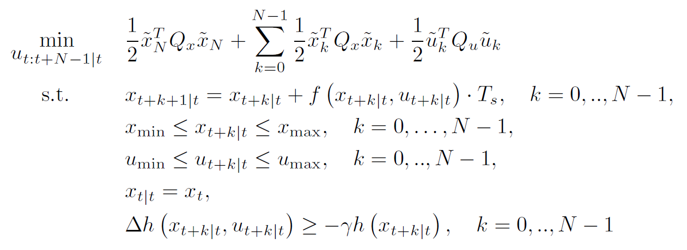
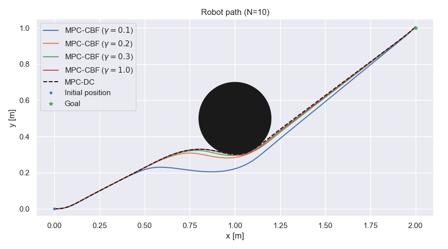
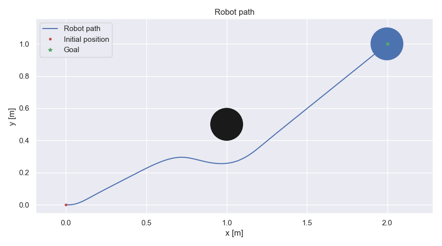
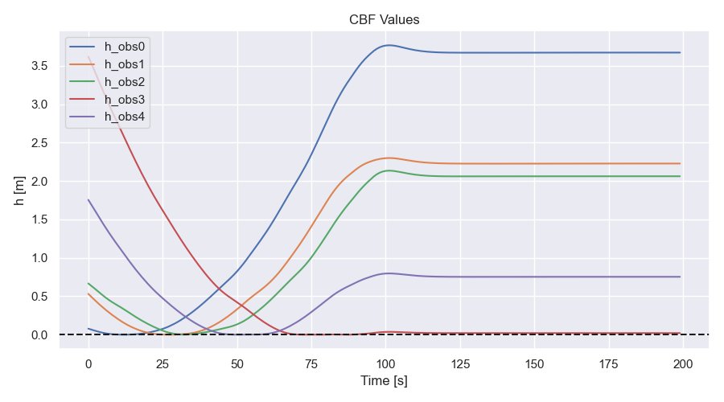
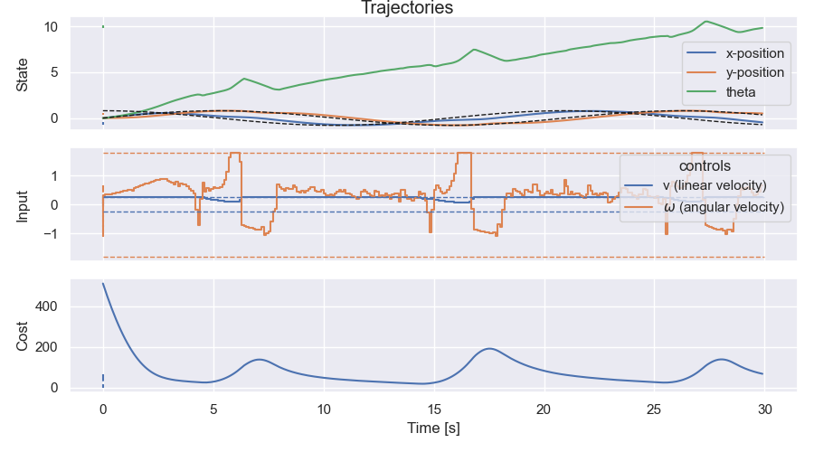
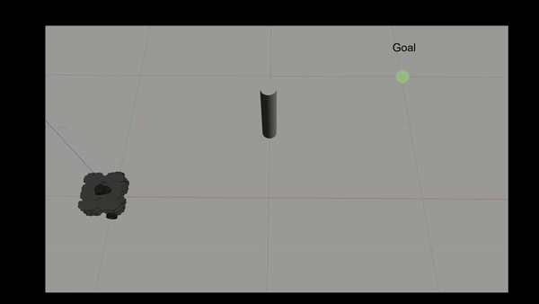

# mpc-cbf
Model Predictive Control with discrete-time Control Barrier Functions (MPC-CBF) for a wheeled mobile robot.

The MPC-CBF optimization problem is given by:
<br>
<p align="center" width="100%">
    
</p>

Results
-------

### Scenario 1
**Path comparison for different values of γ for MPC-CBF and with MPC-DC**
<p align="center" width="100%">
    
    <br>Path comparison
</p>

**MPC-CBF**
<p align="center" width="100%">
    
    <br>Robot path
</p>

<p align="center" width="100%">
    
    <br>Trajectories
</p>


### Scenario 3
<p align="center" width="100%">
    
    <br>Robot path
</p>

<p align="center" width="100%">
    
    <br>CBF values
</p>

### Scenario 4
<p align="center" width="100%">
    
    <br>Robot path
</p>

<p align="center" width="100%">
    
    <br>CBF values
</p>

<p align="center" width="100%">
    
    <br>Trajectories
</p>


### Scenario 5
<p align="center" width="100%">
    
    <br>Robot path
</p>


### Scenario 6
<p align="center" width="100%">
    
    <br>Robot path
</p>

<p align="center" width="100%">
    
    <br>CBF values
</p>


### Gazebo simulation with turtlebot3

<p align="center" width="100%">
    
</p>

<p align="center" width="100%">
    
</p>


Installation
------------

To use this project, install it locally via:
```
git clone https://github.com/elena-ecn/mpc-cbf.git
```

The dependencies can be installed by running:
```
pip install -r requirements.txt
```

The controller configuration can be changed through the config.py.

To execute the code, run:
```
python3 main.py
```

License
-------
The contents of this repository are covered under the [MIT License](LICENSE).


References
----------
* [[1] J. Zeng, B. Zhang, and K. Sreenath, “Safety-Critical Model Predictive Control with Discrete-Time Control
Barrier Function,” in 2021 American Control Conference (ACC), May 2021, pp. 3882–3889.](https://ieeexplore.ieee.org/document/9483029)